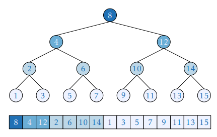
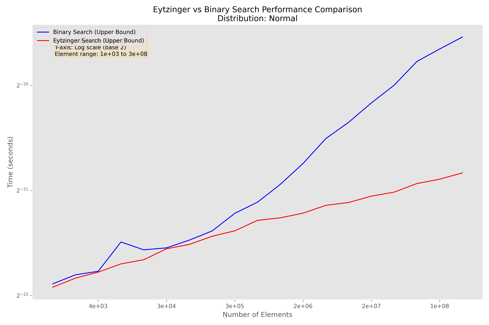
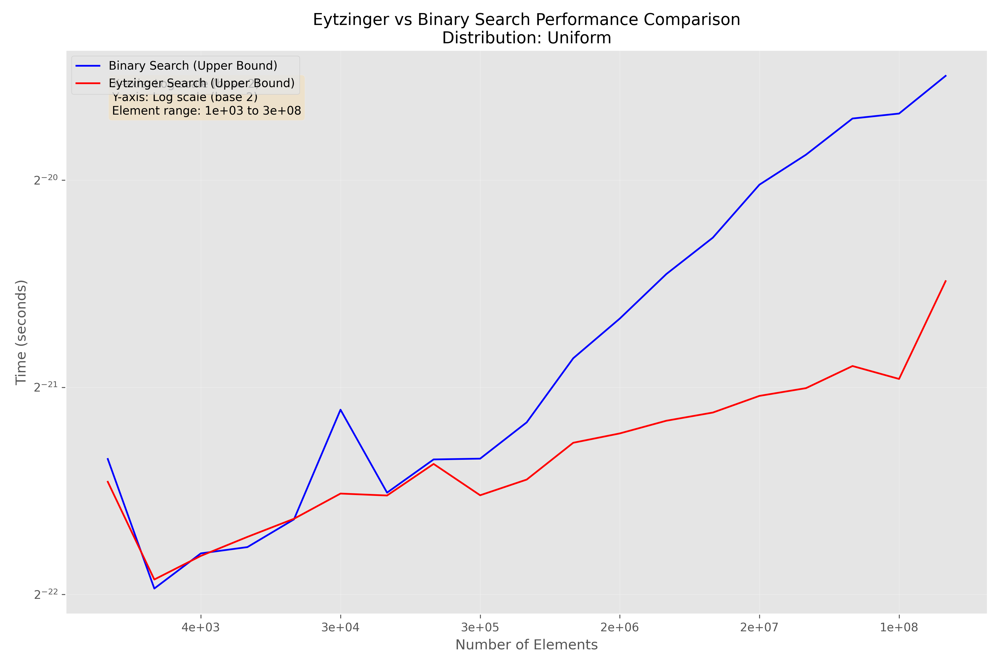
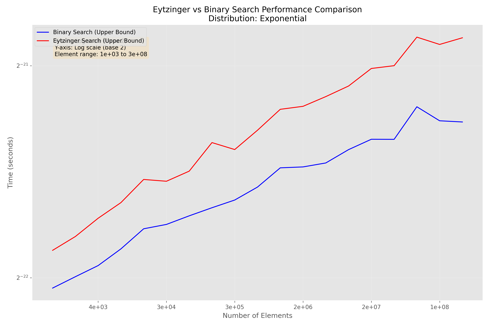

# Eytzinger

## What is it?
This repo contains an implementation of the Eytzinger layout for array storage and search based on [this paper](https://arxiv.org/abs/1509.05053) by Pat Morin and Paul-Virak Khuong.
The provided C++ code implements an efficient search method utilizing the Eytzinger layout, which organizes data in a complete binary search tree fashion within a linear array. This approach optimizes cache usage during searches by ensuring spatial and temporal locality.

## How does the Eytzinger Layout work?
The Eytzinger layout is a method of organizing data in an array that represents a complete binary search tree. Data nodes are stored in breadth-first order, which leverages modern CPU cache architectures for faster querying. This layout is especially effective for binary search operations, as detailed in the paper:

>"In the Eytzinger layout, the data is viewed as being stored in a complete binary search tree and the values of the nodes in this virtual tree are placed in the array in the order they would be encountered in a left-to-right breadth-first traversal." (Morin et al., 2015, p. 8)

The Eytzinger layout can be visualized as follows:



To create this layout, we use a recursive function that traverses the virtual binary tree and places elements in the array according to their position in the tree. The first element (index 1) is the root, its left child is at index 2, right child at index 3, and so on.

## Why is it more efficient?
The Eytzinger layout enhances search performance primarily due to better cache utilization, prefetching behavior, and branch-free search implementation. The layout is conducive to modern processor architecture, which often features sophisticated prefetching mechanisms that benefit from regular access patterns.

### Cache Efficiency
The Eytzinger layout improves cache hits during searches by organizing data in a way that follows typical query patterns, making better use of the CPU cache. As explained in the paper:
>"For large values of n, the Eytzinger layout, combined with a branch-free search and explicit prefetching, is the fastest method because it efficiently utilizes the cache hierarchy by preloading the necessary data in advance, reducing the overall number of cache misses." (Morin et al., 2015, p. 22)

This alignment of data access patterns with prefetching strategies minimizes the number of cycles wasted on waiting for memory fetches.

### Branch-Free Search
The Eytzinger layout allows for a branch-free implementation of binary search. This eliminates branch misprediction penalties, which can cost 10-20 cycles each. The search algorithm uses bitwise operations to navigate the virtual tree structure, making it more efficient on modern CPUs.

### Prefetching
The layout enables effective use of prefetching instructions. By predicting which cache lines will be needed in the near future, the algorithm can request them in advance, further reducing memory access latency. This is particularly effective because the Eytzinger layout ensures that nodes in the same level of the tree are stored in adjacent memory locations.

### Memory Alignment
The Eytzinger implementation aligns the array to cache line boundaries, ensuring that each cache line fetch brings in the maximum amount of useful data. This alignment, combined with the layout's properties, allows for efficient prefetching of entire cache lines that are likely to be used in subsequent iterations of the search.

## When is it more efficient?
These benchmarks were performed on randomly created lists of increasing size. 1000 iterations of each benchmark were done to ensure accuracy. The full methodology can be examined in ```benchmark.cpp```.



When searching with a normal distribution, The searched values are more likely to be near the middle of the array.



When searching with a uniform distribution, The searched values are equally likely to be anywhere in the array.



When searching with a exponential distribution, The searched values are more likely to be near the beginning of the array.

* Across all search distributions, the Eytzinger algorithm provides a significant performance improvement over the standard upper bound algorithm, with an average speedup of 36.45%. (Note that this implementation of eytzinger search performs poorly on exponential distributions)
* For smaller arrays (less than 65,536 elements), the performance difference is less pronounced and sometimes favors the standard upper bound.
* As the array size grows, especially beyond 2 million elements, the Eytzinger algorithm consistently outperforms the standard upper bound by a wider margin.
* The performance gain is generally more significant for the Uniform and Normal distributions compared to the Exponential distribution, particularly for smaller array sizes.
* The maximum speedup observed is for the largest array size (268,435,456) with a Uniform distribution, where Eytzinger is about 1.99 times faster.

## What does what?
* eytzinger.hpp: Contains the C++ implementation of the Eytzinger layout for arrays.
* benchmark.cpp: Creates random arrays of various magnitudes, puts them in the appropriate order, then queries them using both standard C++ binary search and Eytzinger search.
* graph.py: Generates a graph using matplotlib based on the .csv output of ```./benchmark```.

To implement this in your project, include the eytzinger header. To benchmark the code yourself, run ```make```, and then ```./benchmark``` from the working directory. Note that GCC is a requirement, as the implementation uses GCC-specific intrinsics like `__builtin_prefetch` and `__builtin_ffs` for optimal performance.